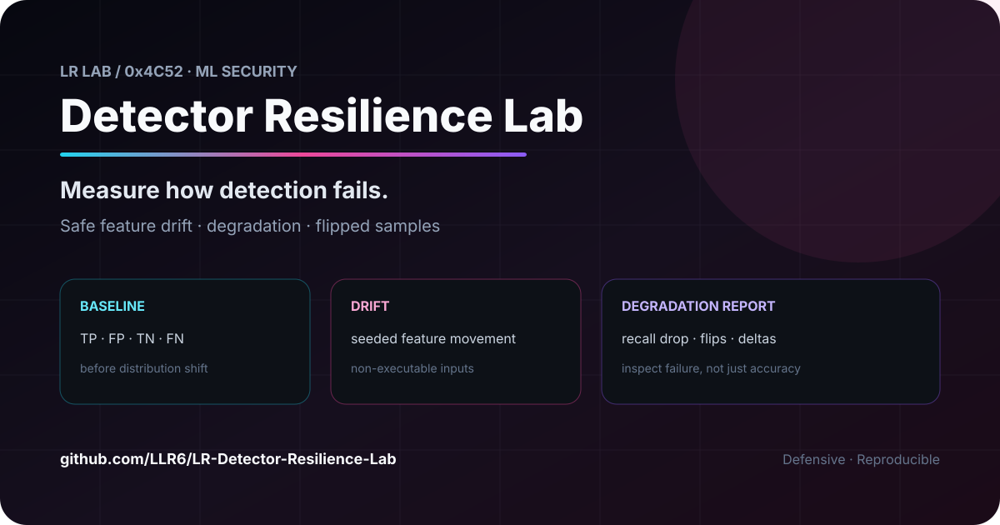
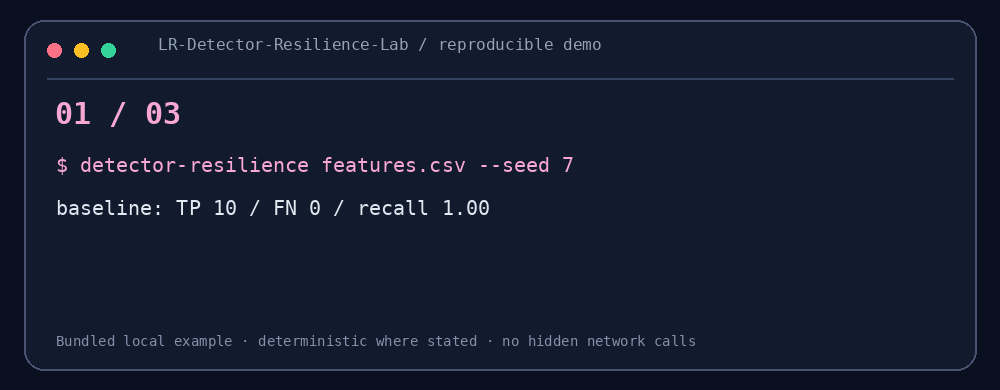

# Detector Resilience Lab

<!-- LR-LAB-CHROME:START -->
<p align="center">
  <a href="https://github.com/LLR6"></a>
  
</p>
<p align="center"><strong>Measure how detection fails.</strong><br><sub>Safe feature-drift experiments for defensive models</sub></p>
<p align="center"><a href="https://github.com/LLR6/LR-Detector-Resilience-Lab/stargazers"></a>
   </p>
<p align="center"><a href="https://github.com/LLR6">Profile</a> · <a href="https://github.com/LLR6?tab=repositories">All projects</a> · <a href="https://github.com/LLR6/LR-Detector-Resilience-Lab/issues">Issues</a></p>
<!-- LR-LAB-CHROME:END -->

<!-- LR-FAMILY-NAV:START -->
<p align="center"><a href="#5-分钟-demo">5-minute demo</a> · <a href="./examples">Examples</a> · <a href="./src">Source</a> · <a href="./tests">Tests</a></p>
<!-- LR-FAMILY-NAV:END -->


<p align="center"></p>
<p align="center"></p>
<p align="center"><strong>Measure how detection fails.</strong></p>
<p align="center">Safe feature-space drift experiments for defensive model research.</p>
<p align="center">   </p>

## 30 秒看懂

在不可执行的数值特征上训练透明逻辑回归检测器，再对恶意标签样本施加固定种子的特征漂移，比较漂移前后的 TP / FP / TN / FN，并保留翻转样本的特征差值。

```text
Labeled features → Train → Baseline → Safe drift → Degradation report
```

## 5 分钟 Demo

```bash
python -m pip install -e .
detector-resilience examples/features.csv --seed 7 --output report.json
```

仓库样例的固定结果：

| 阶段 | TP | FN | Recall |
|---|---:|---:|---:|
| Baseline | 10 | 0 | 1.00 |
| Feature drift | 8 | 2 | 0.80 |

## 为什么值得研究

高测试集准确率不能说明模型面对分布漂移仍然可靠。报告同时输出模型退化、翻转样本和逐特征变化，便于讨论鲁棒性、反例与再训练策略。

## 边界

实验只修改 CSV 中的数值特征，不读取、生成或修改可执行文件，也不提供杀软绕过载荷。样例很小，只用于验证实验管线；结论不能外推到真实恶意软件数据集。

## 研究路线

加入交叉验证、校准曲线、多个分类器、特征归因、漂移检测与公开安全数据集适配器。

作者：LLR6 · MIT License

<!-- LR-CONTENT-UPGRADE-2:START -->
## v0.2：不要只看一个分类阈值

模型在 `0.5` 阈值下掉 Recall，并不代表整个决策边界都同样脆弱。

现在可以同时扫描多个阈值：

```bash
detector-resilience examples/features.csv \
  --seed 7 \
  --strength 1.0 \
  --threshold 0.5 \
  --thresholds 0.3,0.4,0.5,0.6,0.7 \
  --output report.json
```

每个阈值都会记录：

- baseline TP / FP / TN / FN
- drift 后 TP / FP / TN / FN
- `recall_drop`
- `false_positive_rate_delta`

这样可以区分两件事：

1. 模型本身在 feature drift 后整体退化；
2. 只是某个固定 operating threshold 对 drift 特别敏感。

实验仍只修改数值特征 CSV，不处理或生成任何可执行文件。

<!-- LR-CONTENT-UPGRADE-2:END -->

<!-- LR-DEEP-CONTENT-2:START -->
### Drift-strength curve

除了固定 `--strength` 和多阈值扫描，现在还可以直接观察 drift 强度曲线：

```bash
detector-resilience examples/features.csv \
  --seed 7 \
  --threshold 0.5 \
  --thresholds 0.3,0.5,0.7 \
  --strengths 0,0.5,1,1.5 \
  --output report.json
```

每个强度点记录：

- baseline recall；
- drift 后 recall；
- recall drop；
- drift 后 FPR；
- flipped malicious sample 数。

`strength=0` 作为自检点，理论上不应产生 drift recall drop。CI 会自动运行这组实验并保存 JSON 报告。
<!-- LR-DEEP-CONTENT-2:END -->

<!-- LR-RELATED:START -->
### Related LR Lab projects
- [Detection Threshold Lab](https://github.com/LLR6/lr-detection-lab) — inspect threshold trade-offs before model drift.
- [LR-SOC-Copilot](https://github.com/LLR6/LR-SOC-Copilot) — move from model output to evidence-backed investigation.
- [NightWatch](https://github.com/LLR6/Cybersecurity-Detection-Engineering-Android-Automation-Learning-by-Building) — rule-based detection and event correlation.
<!-- LR-RELATED:END -->

<!-- LR-ENGINEERING-REF:START -->
## Engineering Reference

[Architecture](docs/ARCHITECTURE.md) · [Security](SECURITY.md) · [Contributing](CONTRIBUTING.md) · [Changelog](CHANGELOG.md) · [Release checklist](docs/RELEASE_CHECKLIST.md) · [Report schema](schemas/resilience-report.schema.json)

These files document the project's architecture, safety boundaries, reproducibility assumptions and release process.
<!-- LR-ENGINEERING-REF:END -->

<!-- LR-LAB-FOOTER:START -->
---
<p align="center"><sub>Part of <a href="https://github.com/LLR6">LR Lab</a> · Security × AI × Android × Automation</sub><br><sub>Build things that are useful, inspectable, and reproducible.</sub></p>
<!-- LR-LAB-FOOTER:END -->

